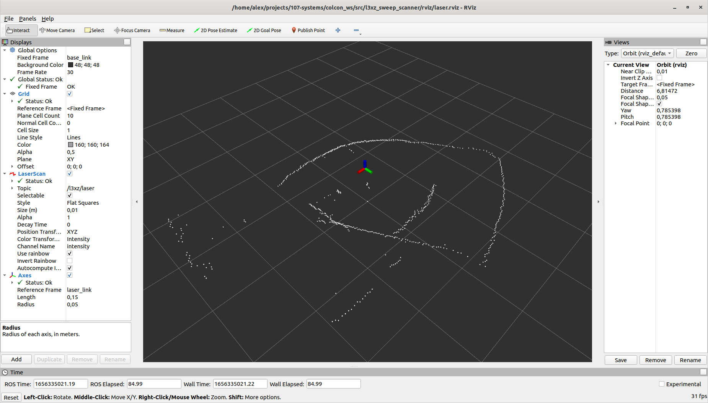

<a href="https://107-systems.org/"></a>
:floppy_disk: `l3xz_sweep_scanner`
==================================
[](https://github.com/107-systems/l3xz_sweep_scanner/actions/workflows/ros2.yml)
[](https://github.com/107-systems/l3xz_sweep_scanner/actions/workflows/spell-check.yml)

ROS driver for Scanse Sweep 360° 2D LIDAR.

### How-to-build
```bash
# Clone this repository into colcon_ws/src.
git clone https://github.com/107-systems/l3xz_sweep_scanner
# Invoke 'colcon build' from repository root.
source /opt/ros/galactic/setup.bash
colcon build
```

### How-to-run
```bash
. install/setup.bash
ros2 launch l3xz_sweep_scanner laser.py
rviz2 --display-config src/l3xz_sweep_scanner/rviz/laser.rviz
```
**Note**: Possible you need to configure the right USB port in `launch`/[`laser.py`](launch/laser.py).

<p align="center">
  
</p>

### Interface Documentation
#### Published Topics
| Default Name | Type |
|:-:|:-:|
| `/l3xz/laser` | [`sensor_msgs/LaserScan`](https://docs.ros.org/en/noetic/api/sensor_msgs/html/msg/LaserScan.html) |

#### Parameters
| Name | Default | Description |
|:-:|:-:|-|
| `topic` | `laser ` | Name of ROS2 topic under which the `sensor_msgs/LaserScan` data is streamed. |
| `serial_port` | `/dev/ttyUSB0 ` | Serial port under which the Scanse Sweep is connected to the system. |
| `rotation_speed` | 1-10 | Rotations per second of the sensor head. |
| `sample_rate ` | 500, 750, 1000 | Laser scan rate in Hz, i.e. 500 = 500 laser distance measurements per second. |
| `frame_id` | `laser_frame` | Topic under which the is published. |
